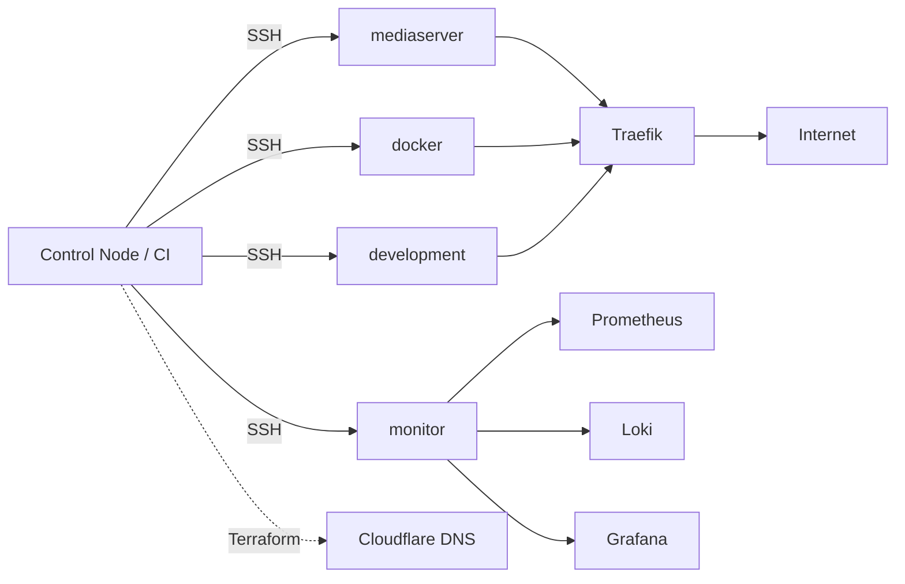

# Architecture

> System design and deployed services for the homelab.

## Overview

A control node runs the playbooks against four host groups (`mediaserver`,
`docker`, `development`, `monitor`). Each container is defined by a unified
service entry that drives Traefik (routing), Gatus (health), Prometheus
(metrics), Homepage (dashboard), and Cloudflare (DNS). Service definitions
are aggregated across hosts and rendered into config templates.

## Diagram



## Playbooks

| Playbook | Purpose |
|----------|---------|
| `plays/setup.yml` | One-time host initialisation: base packages, Docker, reboot |
| `plays/deploy-containers.yml` | Deploy containers defined in each host's `containers` list |
| `plays/update.yml` | Full update cycle (apt, containers, Traefik/Gatus/Homepage); runs on push to `main` |
| `plays/clean.yml` | apt cache, journal logs, `docker prune` |

## Proxmox VMs

Hosts themselves are provisioned with Terraform (`terraform/proxmox/`,
`bpg/proxmox`) and made Ansible-ready by cloud-init:

- **Golden template** — VM ID `9000` on `local-zfs`, built once from the
  **Debian 13 "trixie"** generic cloud image with **`qemu-guest-agent`** baked in
  (so the provider can read each clone's IP at create time).
- **`./modules/vm`** clones the template, injects the login user, SSH key and IP
  via cloud-init, and exposes knobs for CPU, memory, disk, network, boot order
  (`startup`), and protection.
- **Hand-off to Ansible** — cloud-init grants the user passwordless sudo, so a new
  VM is reachable for `plays/setup.yml` (base packages + Docker) with no manual prep.

See the [README](README.md#cloud-init-template) for the one-time template build.

## Service Definition Pattern

Every container in `tasks/docker/*.yml` follows the same pattern:

1. Create directory with correct permissions
2. Create container via `community.docker.docker_container`
3. Define a service entry (`set_fact`) with metadata
4. Append the entry to the `docker_services` list

The `docker_services` list is aggregated across all hosts (via
`tasks/core/aggregate_services.yml`) and feeds:

- Homepage dashboard (`config/homepage/services.yaml.j2`)
- Traefik routing (`config/traefik/dynamic/http.yml.j2`)
- Gatus monitoring (`config/gatus/config.yaml.j2`)
- Prometheus scrape config (`config/prometheus/config.yml.j2`)
- Cloudflare DNS via Terraform

### Required fields

| Variable | Type | Description |
|----------|------|-------------|
| `name` | string | Service identifier, used for the container name |
| `ip` | string | Host IP, typically `{{ inventory_hostname }}` |
| `friendly_name` | string | Group name for Homepage display |

### Optional fields

| Variable | Type | Default | Description |
|----------|------|---------|-------------|
| `description` | string | `name` capitalised | Homepage description |
| `icon` | string | `name` lowercase | Homepage icon (from [Dashboard Icons](https://github.com/walkxcode/dashboard-icons)) |
| `host` | string | — | Full hostname for Traefik routing (e.g. `myapp.suskins.co.uk`) |
| `port` | integer | — | Primary service port |
| `scheme` | string | — | `http` or `https` |
| `secured` | bool | `false` | Require Authelia auth via Traefik middleware |
| `homepage` | bool | `false` | Show on Homepage |
| `proxied` | bool | `false` | Include in Traefik routing |
| `path_prefix` | string | — | Restrict Traefik routing to this path |
| `middleware` | string | — | Additional Traefik middleware |
| `healthcheck` | bool | `false` | Enable Gatus monitoring |
| `healthcheck_path` | string | — | Custom health endpoint path |
| `metrics` | bool | `false` | Enable Prometheus scraping |
| `metrics_port` | integer | `port` | Port exposing metrics |
| `metrics_path` | string | `/metrics` | Metrics endpoint |

### Example

```yaml
- name: MYAPP - Define service entry
  ansible.builtin.set_fact:
    myapp_entry:
      name: myapp
      description: My application
      icon: myapp
      host: "myapp.{{ domain }}"
      ip: "{{ inventory_hostname }}"
      friendly_name: "{{ friendly_name }}"
      port: 8080
      scheme: http
      secured: true
      healthcheck: true
      healthcheck_path: /health
      homepage: true
      proxied: true

- name: MYAPP - Append to docker_services
  ansible.builtin.set_fact:
    docker_services: "{{ docker_services + [myapp_entry] }}"
```

## Image Updates

Renovate monitors `tasks/docker/*.yml` and opens PRs for new image tags.
Images are pinned to specific versions — never `:latest`.

---

## Appendix: Deployed Services

_Generated from live inventory on 2026-06-11T19:47:02Z. Source of truth is `group_vars/`._

### Development

| Service | Host | Port | Direct URL | URL | Exposed |
|---------|------|------|------------|-----|---------|
| alloy | 192.168.0.204 | — | — | — | false |
| authelia | authelia | 9091 | [authelia:9091](http://authelia:9091) | [authelia.suskins.co.uk](https://authelia.suskins.co.uk) | false |
| traefik | 192.168.0.204 | 8082 | [192.168.0.204:8082](http://192.168.0.204:8082) | [traefik.suskins.co.uk](https://traefik.suskins.co.uk) | false |

### Docker

| Service | Host | Port | Direct URL | URL | Exposed |
|---------|------|------|------------|-----|---------|
| alloy | 192.168.0.202 | — | — | — | false |
| family-hub | 192.168.0.202 | 8081 | [192.168.0.202:8081](http://192.168.0.202:8081) | [hub.suskins.co.uk](https://hub.suskins.co.uk) | false |
| home | 192.168.0.202 | 3000 | [192.168.0.202:3000](http://192.168.0.202:3000) | [home.suskins.co.uk](https://home.suskins.co.uk) | false |
| mcpjungle | 192.168.0.202 | 8090 | [192.168.0.202:8090](http://192.168.0.202:8090) | [mcp.suskins.co.uk](https://mcp.suskins.co.uk) | false |
| pubgolf | 192.168.0.202 | 3003 | [192.168.0.202:3003](http://192.168.0.202:3003) | [pubgolf.me](https://pubgolf.me) | false |
| pubgolf-backend | 192.168.0.202 | 8080 | [192.168.0.202:8080](http://192.168.0.202:8080) | [api.pubgolf.me](https://api.pubgolf.me) | false |
| wedding | 192.168.0.202 | 3004 | [192.168.0.202:3004](http://192.168.0.202:3004) | [wedding.suskins.co.uk](https://wedding.suskins.co.uk) | false |
| wedding-db | 192.168.0.202 | — | — | — | false |

### Games

| Service | Host | Port | Direct URL | URL | Exposed |
|---------|------|------|------------|-----|---------|
| games | 192.168.0.202 | 80 | [192.168.0.202:80](http://192.168.0.202:80) | [games.suskins.co.uk](https://games.suskins.co.uk) | false |
| minecraft | 192.168.0.125 | 25566 | [192.168.0.125:25566](http://192.168.0.125:25566) | [minecraft.suskins.co.uk](https://minecraft.suskins.co.uk) | false |
| starscream | 192.168.0.125 | 8080 | [192.168.0.125:8080](http://192.168.0.125:8080) | [starscream.suskins.co.uk](https://starscream.suskins.co.uk) | false |

### General

| Service | Host | Port | Direct URL | URL | Exposed |
|---------|------|------|------------|-----|---------|
| homeassistant | 192.168.0.65 | 8123 | [192.168.0.65:8123](http://192.168.0.65:8123) | [homeassistant.suskins.co.uk](https://homeassistant.suskins.co.uk) | false |
| proxmox | 192.168.0.253 | 8006 | [192.168.0.253:8006](http://192.168.0.253:8006) | [pve.suskins.co.uk](https://pve.suskins.co.uk) | false |
| truenas | 192.168.0.100 | 443 | [192.168.0.100:443](http://192.168.0.100:443) | [nas.suskins.co.uk](https://nas.suskins.co.uk) | false |
| unifi | 192.168.0.1 | 443 | [192.168.0.1:443](http://192.168.0.1:443) | [unifi.suskins.co.uk](https://unifi.suskins.co.uk) | false |

### Media

| Service | Host | Port | Direct URL | URL | Exposed |
|---------|------|------|------------|-----|---------|
| alloy | 192.168.0.201 | — | — | — | false |
| radarr-mcp | 192.168.0.201 | 4200 | [192.168.0.201:4200](http://192.168.0.201:4200) | — | false |
| sonarr-mcp | 192.168.0.201 | 9171 | [192.168.0.201:9171](http://192.168.0.201:9171) | — | false |

### Monitoring

| Service | Host | Port | Direct URL | URL | Exposed |
|---------|------|------|------------|-----|---------|
| alloy | 192.168.0.203 | — | — | — | false |
| gatus | 192.168.0.203 | 8080 | [192.168.0.203:8080](http://192.168.0.203:8080) | [gatus.suskins.co.uk](https://gatus.suskins.co.uk) | false |
| grafana | 192.168.0.203 | 3000 | [192.168.0.203:3000](http://192.168.0.203:3000) | [grafana.suskins.co.uk](https://grafana.suskins.co.uk) | false |
| graphite-exporter | 192.168.0.203 | 9108 | [192.168.0.203:9108](http://192.168.0.203:9108) | — | false |
| loki | 192.168.0.203 | 3100 | [192.168.0.203:3100](http://192.168.0.203:3100) | — | false |
| prometheus | 192.168.0.203 | 9090 | [192.168.0.203:9090](http://192.168.0.203:9090) | [prometheus.suskins.co.uk](https://prometheus.suskins.co.uk) | false |
